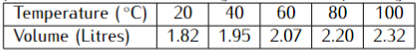
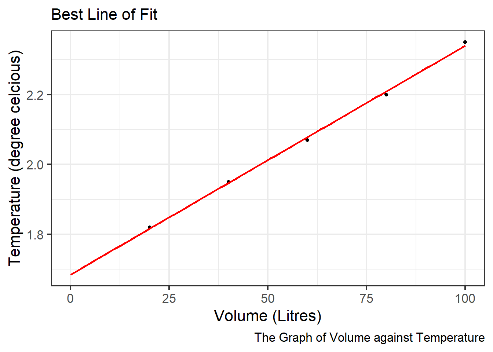
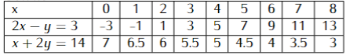
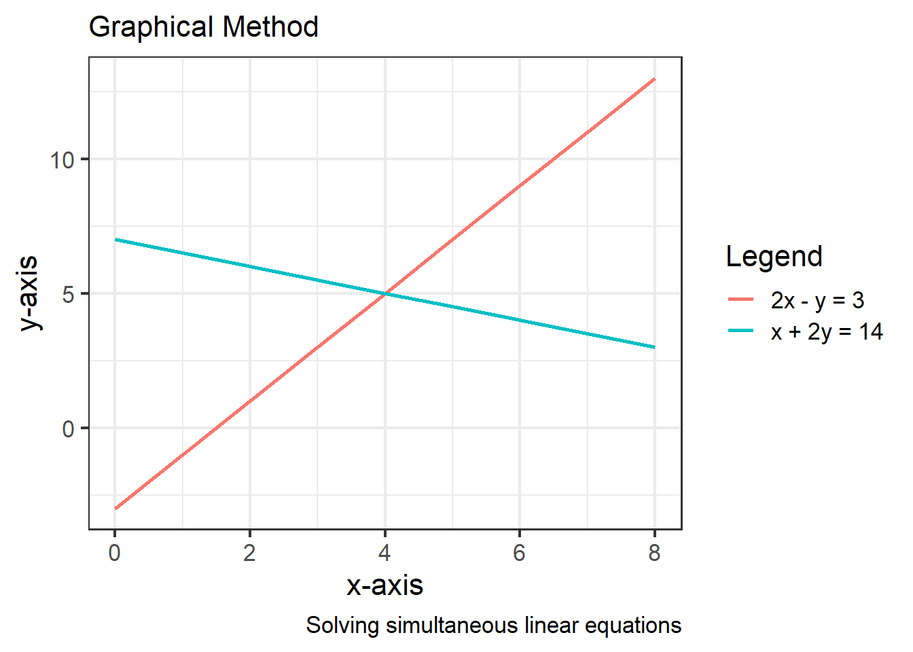
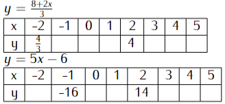

---
header-includes:
  - \usepackage{amsmath}  # Example package
  - \usepackage{cancel}
  - \usepackage{graphicx}  # Example package for graphics
---


# Chapter Fifteen: Co-Ordinates and Graphs

## Co-Ordinates and Graphs {.unnumbered}

A coordinate is an ordered pair of numbers used to locate the position
of a point in a plane and written in the form (x, y). The first number,
x represents the distance along the x-axis and it is called x the
coordinate. The second number, y represents the distance along the
y-axis and it is called the y coordinate.

The x and y axes divide the plane into four regions and each region is
called a **quadrant**. The quadrants are named 1st quadrant, 2nd
quadrant, 3rd quadrant, and 4th quadrant starting with the top
right-hand quadrant and moving in anti-clockwise direction.

**Rectangular Cartesian co-ordinate system** is a system of locating
points using two axes at right angles.

We can also use coordinate systems such as latitude and longitudes and
grid references to locate places on the earth's surface.

## Solved Examples

::: {.callout-note collapse="false"}
# Example 1

A certain quantity of gas is heated from $0\,^{\circ}\mathrm{C}$, and
the volume is measured at different temperatures. The table below gives
the corresponding values:



a\) Draw a graph of volume against temperature using a suitable scale.

b\) Use your graph to find:

i\) The initial volume of the gas

ii\) The volume of the gas when the temperature is
$50\,^{\circ}\mathrm{C}$ and $64\,^{\circ}\mathrm{C}$

iii\) The temperature of the gas when the volume is 1.9 litres and 2.3
litres.
:::

::: {.callout-caution collapse="true"}
# Solution

a\) The graph is depicted in the figure 15.1:


::: {.cell layout-align="left"}
::: {.cell-output-display}
{fig-align='left' width=672}
:::
:::


\b)

i\) The initial volume is obtained by extrapolating the line to cut the
y-axis. Therefore the initial volume is 1.7 litres.

ii\) The volume of the gas at $50\,^{\circ}\mathrm{C}$ is 2 litres

The volume of the gas at $64\,^{\circ}\mathrm{C}$ is 2.1 litres.

iii\) The temperature of the gas at 1.9 litres is
$35\,^{\circ}\mathrm{C}$

The temperature of the gas at 2.3 litres is $98\,^{\circ}\mathrm{C}$
:::

::: {.callout-note collapse="false"}
# Example 2

Solving simultaneous linear equations using graphical methods 


```{=latex}
\begin{equation}
\begin{split}
2x-y&=3 \\
x + 2y &= 14
\end{split}
\end{equation}
```


:::

::: {.callout-caution collapse="true"}
# Solution




::: {.cell layout-align="left"}
::: {.cell-output-display}
{fig-align='left' width=672}
:::
:::


The solution of the two simultaneous equations is at the point of
interception as displayed in the figure above: From the graph, the values of x
and y are: $x=4$ and $y=5$
:::

::: {.callout-note collapse="false"}
## Problems to solve

1.  a\) Use a graphical method to solve the following simultaneous
    equations: \hspace{2.5cm}(7mks)
    


```{=latex}
\begin{equation}
\begin{split}
3x-y&=4 \\
x+4y&=10
\end{split}
\end{equation}
```


     
     b) If the lines cut the y-axis at points P and Q respectively,
    Write down the co-ordinates of the points P and Q.(3mks)

2.  Copy and complete the tables below for:

    a\) The linear equations $3y=8+2x$ and $y=5x-6$ respectively.
    (4mks) 
    


    b\) On a graph paper and on the same grid draw the two linear
    equations in (a) above.  (4mks)

    c\) What is the nature of the two graphs you have drawn? (1mk)

    c\) Use your graphs to solve the simultaneous equations.(1mk)


```{=latex}
\begin{equation}
\begin{split}
-2x+3y&=8 \\
5x-y&=6
\end{split}
\end{equation}
```


:::

